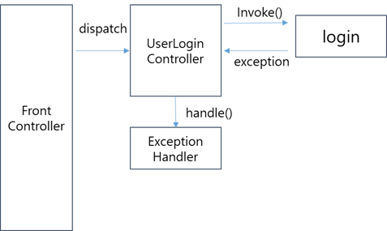

# java-was-2022
Java Web Application Server 2022


## 0. 프로젝트 정보 

이 프로젝트는 우아한 테크코스 박재성님의 허가를 받아 https://github.com/woowacourse/jwp-was 
를 참고하여 작성되었습니다.

## 1. 들어가며

### 1.1. 프로젝트 소개
- HTTP 프로토콜에 대한 이해도를 높인다.
- WAS를 직접 구현함으로써 WAS의 동작 원리에 대해서 학습한다.

### 1.2. 기능
#### 주요 기능 명세
- CRUD 게시판 기능 구현
- HTTP GET, POST 요청 응답
- css, js 등 확장자에 따른 컨텐츠 타입 응답 지원
- 쿠키를 이용한 로그인 기능 구현
- 동적인 HTML 페이지 생성 기능 구현

#### 부가 기능 명세
- 소켓 통신 기반에서 소켓의 연결 상태를 확인해 비정상 종료 탐지 기능 구현
- Annotation으로 HandlerMapping을 지원하도록 로직 구현
```
//아래처럼 annotation으로 handler를 추가할 수 있고, MethodType을 명시할 수 있다.
@RequestMapping(url = "/users/logout")
public class UserLogoutController extends Controller {
    @MethodType(value = "GET")
    public String home(HttpRequest httpRequest, HttpResponse httpResponse) {
        Optional<String> sessionId = httpRequest.getSessionId();
        String parsedSessionId = HttpRequestUtils.parseSessionId(sessionId.get());
        SessionDb.invalidate(parsedSessionId);
        //redirect 뷰를 반환할 수 있다.
        return "redirect:/";
    }
}
```
- 예외를 Mapping된 Handler에게 전달해주는 ExceptionHandler 기능 구현
```
@RequestMapping(url = "/users/login")
public class UserLoginController extends Controller {

    @MethodType(value = "GET")
    public String showForm(HttpRequest httpRequest, HttpResponse httpResponse) {
        return "/user/login.html";
    }
    @MethodType(value = "POST")
    public String login(HttpRequest httpRequest, HttpResponse httpResponse) {
        //로직 생략
    }

    @ExceptionHandler(exception = "UserInfoException.class")
    public String failLogin(HttpRequest httpRequest, HttpResponse httpResponse) {
        return "/user/login_failed.html";
    }
}


ExceptionHandler와 handlerMapping 동작 흐름은 대강 위와 같다.

```
- 템플릿 엔진 PoroTouch 구현 - 반복문 지원
  - 템플릿 엔진 사용 예시
```
^# users #^
                <tr>
                    <th scope="row">^P index P^</th> <td>^P userId P^</td> <td>^P name P^</td> <td>^P email P^</td><td><a href="#" class="btn btn-success" role="button">수정</a></td>
                </tr>
^/ users /^
```
  - 템플릿 엔진 문법
    - 객체 반복
    ^# {name} #^로 반복문 시작, ^/ {name} /^로 반복문의 종료
    - 각 속성은 ^P {name} P^로 attribute를 render할 수 있다.

- 인터셉터로 Controller 실행 전/후로 Logging 및 세션 확인 기능 제공


### 1.3. 사용 기술
#### Language
- Java
#### Build Tool
- Gradle
#### DB
- MySQL

## 2. 서비스 미리보기

1. 회원 가입 화면


회원가입 시 유효성 검사를 진행하며, 회원 정보를 저장하고 홈 화면으로 redirect됩니다.

2. 로그인 화면


로그인 실패 시 실패 원인을 보여주는 login fail 뷰를 보여주고, 성공 시 게시글 목록으로 redirect됩니다.

3. 회원정보 수정 화면


이름과 비밀번호, email을 변경할 수 있고 기존 비밀번호가 일치하지 않을 시 변경 실패 뷰를 보여주고, 성공 시 게시글 목록으로 redirect됩니다.

4. 회원정보 목록 화면


로그인 상태에서는 회원 목록을 조회할 수 있습니다. 자신의 회원 정보 수정에만 접근 가능합니다.


## 3. 블로그 학습 정리

- [Socket의 연결종료와 Timeout 설정하기](https://porolog.tistory.com/38)
- [Reflection, Annotation 활용기 1 - @RequestMapping 구현하기](https://porolog.tistory.com/39)
- [Reflection, Annotation 활용기 2 - @ExceptionHandler 구현하기](https://porolog.tistory.com/40)
- [Dynamic Proxy, CGLIB - Java로 인터셉터 만들어보기](https://porolog.tistory.com/41)
